# Springboot图书管理系统

#### 介绍
本系统为采用Springboot + Mysql + MybatisPlus+Thymeleaf技术架构开发的单端电脑端图书管理系统。该系统有两个登入身份、共8个功能模块（修改密码为共用模块）

#### 软件架构
Springboot | MybatisPlus | Thymeleaf | Maven | Mysql 

#### 功能结构
该系统支持两种不同的身份登入，分别是读者与管理员。不同身份的对应功能如下：
.jpg)

#### 功能介绍
##### 【代码结构与数据库截图】
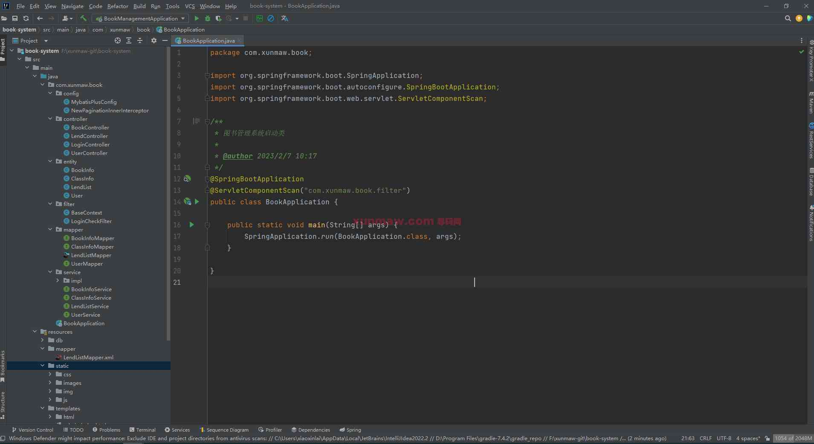
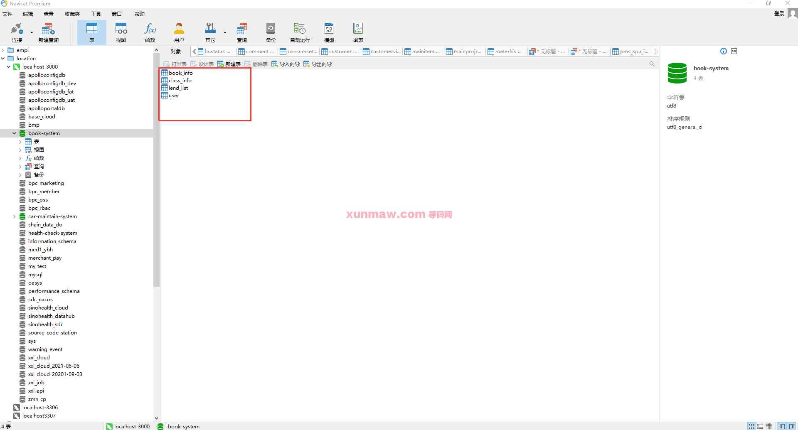
##### 【功能详述】 
管理员与读者使用相同登录界面，在登录页进行身份的选择
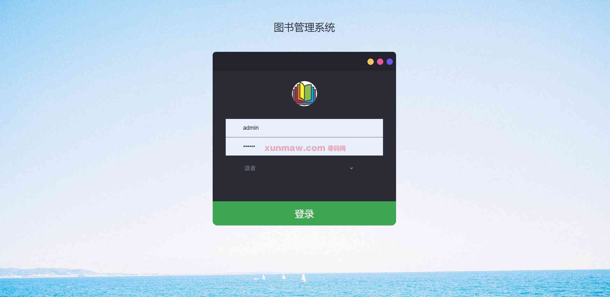
   以管理员身份登录后，首页显示该系统的基本功能介绍。此时左侧工具栏可以看到管理员身份的所有功能：图书管理、人员管理、借还管理、密码修改。

△图书管理
   图书管理模块中可进行【添加图书】与【图书管理】。
   图书添加中，在录入界面录入图书名、作者、出版社、ISBN等图书相关信息，分类的填写会影响图书在图书管理中的检索。点击“添加”后，即可成功添加图书。添加的图书可在二级菜单“图书管理”中查看。
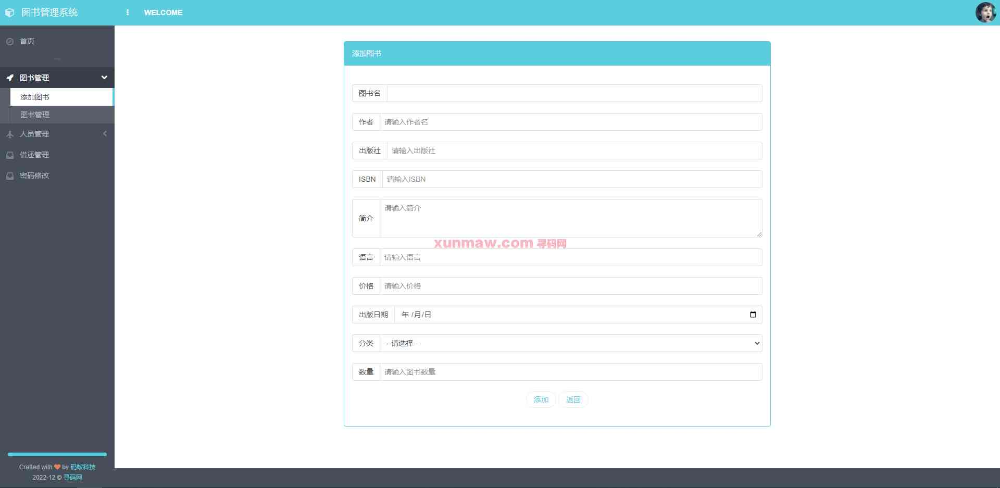
 图书管理列表中为系统的现有图书，可以通过界面上方的分类、图书名进行检索。列表中的图书可以进行“查看详情”、“编辑”、“删除”操作。
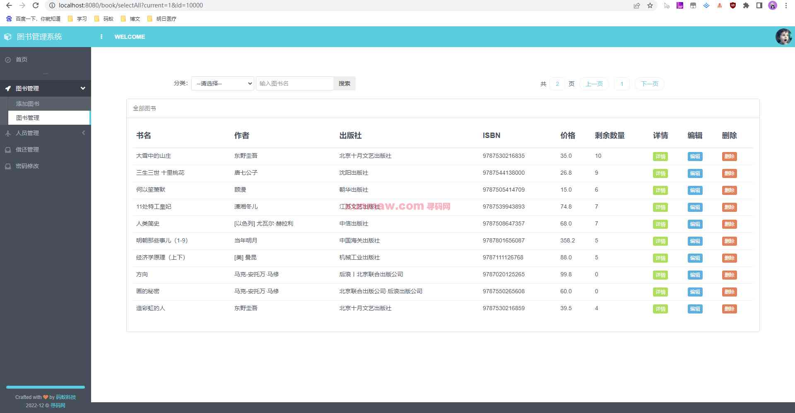

△人员管理
   人员管理与图书管理结构相同，可进行【添加人员】与【人员管理】。
   添加人员时需录入姓名、用户名、密码、性别、生日、地址、电话、及角色信息。成功添加的人员可以在【人员管理】中查看。
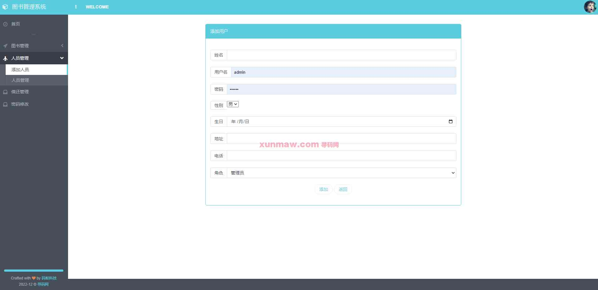
   人员管理列表中现有的人员信息，可以通过界面上方的角色、姓名进行检索。列表中的人员可以进行“编辑”、“删除”操作。
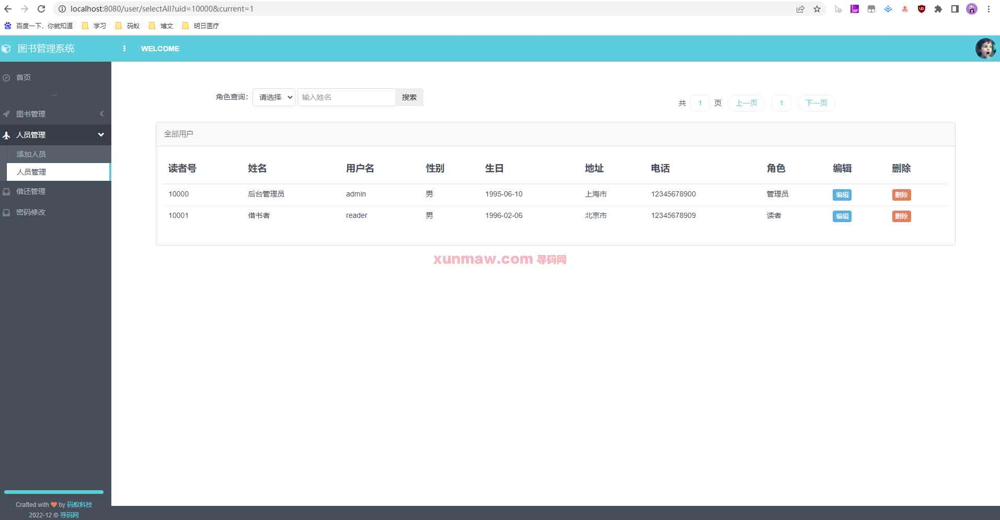

△借还管理
   借还管理模块显示当前图书借还的流水日志，支持通过借还状态与图书名进行搜索。按借出时间顺序显示借还日志，日志列表中显示书籍当前的还书状态。状态包含“未还”、“超期”、“已还”、“已催还”
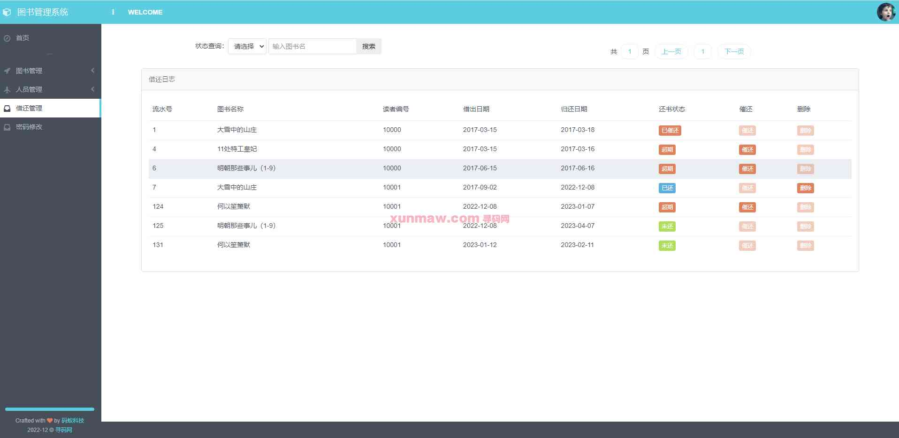

△密码修改
   密码修改模块中用户可以通过录入旧密码与新密码，并确认新密码来修改密码。
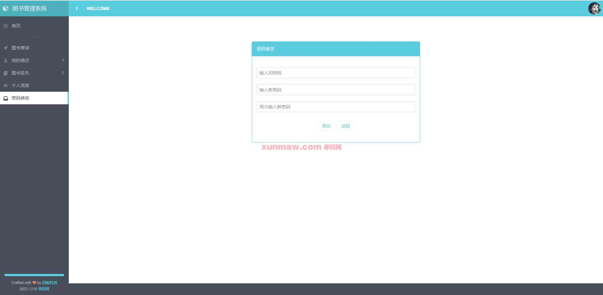
   以读者身份登录后，首页显示该系统的基本功能介绍。此时左侧工具栏可以看到读者身份的所有功能：图书查询、我的借还、图书挂失、个人信息、密码修改。

△图书查询
   图书查询模块中可以通过分类与图书名搜索图书。图书列表显示系统的所有图书，可以“查看详情”与“借阅图书”。
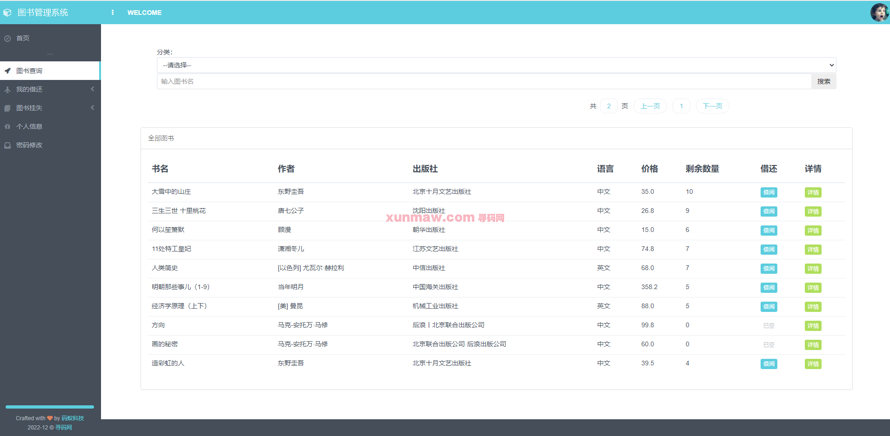

△我的借还
   我的借还可以进行【我要还书】与【借还管理】。
   我要还书页面可以看到当前账号的借阅书籍，书籍列表显示书籍基本信息、借出天数、应还天数、图书状态与还书续借操作。其中包含了已经超期、挂失的图书无法续借，未还图书可以归还与续借的规则逻辑。
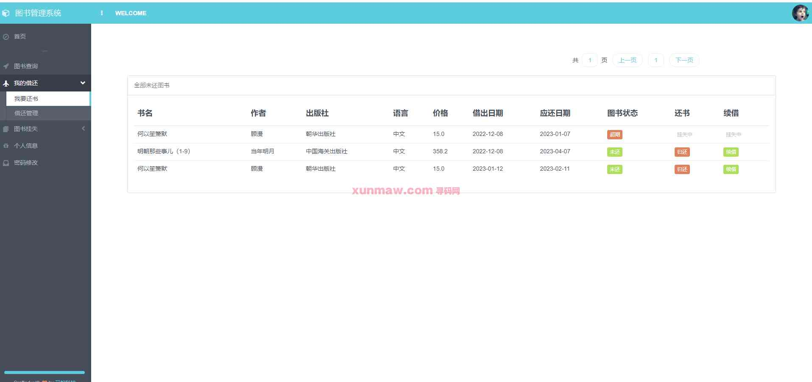

借还管理中显示账户的借还流水，包含借阅、归还的操作日志，并显示该条日志的图书状态。可以对日志进行“删除”操作。  
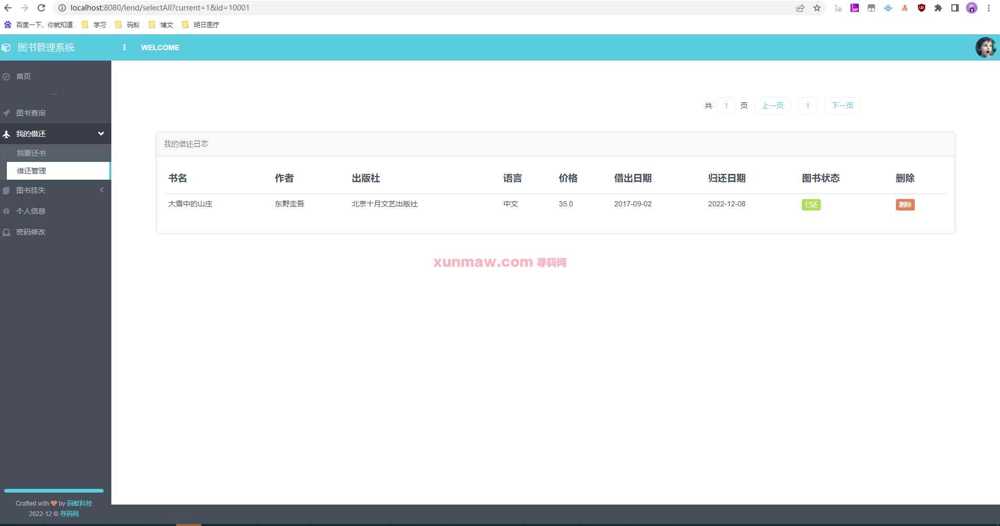

△图书挂失
   图书挂失分为【挂失】和【解挂】。
   挂失列表中显示正在借阅与挂失的图书，显示其借阅状态与挂失状态，对未挂失的图书可以进行“挂失”操作。  
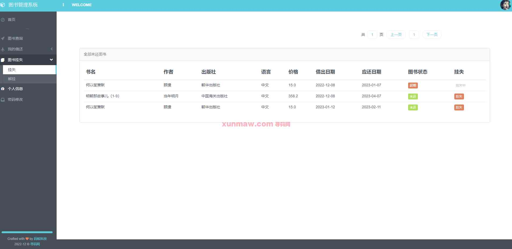
   解挂列表中显示正在挂失中的书籍，可以进行“解挂”与“赔偿”操作。   
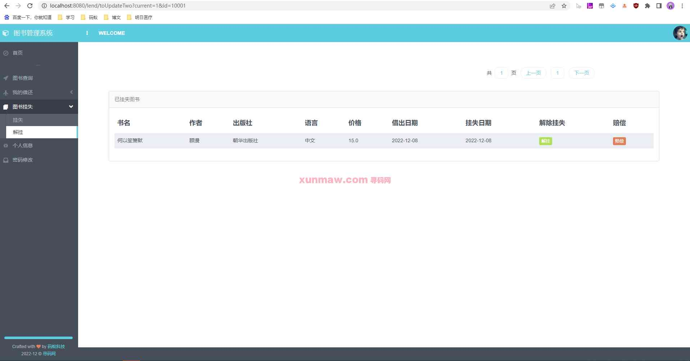

△个人信息
   个人信息显示当前账户的个人信息，点击“修改”可以修改个人信息。    
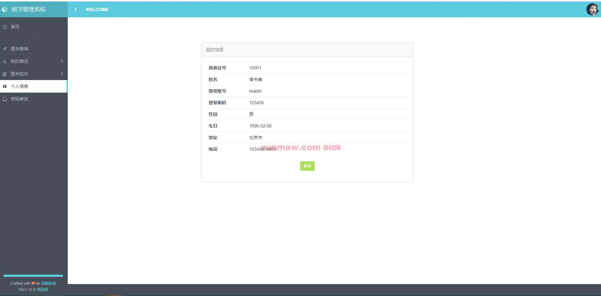

△密码修改
   本功能模块与管理员身份中的【密码修改】功能一致。

#### 使用说明
1. 创建数据库，执行数据库脚本
2. 修改jdbc数据库连接参数
3. 下载安装maven依赖jar
4. 在tomcat服务器部署项目  
    请求地址： http://localhost:8080/book    
    用户名：admin  
    密码：admin  